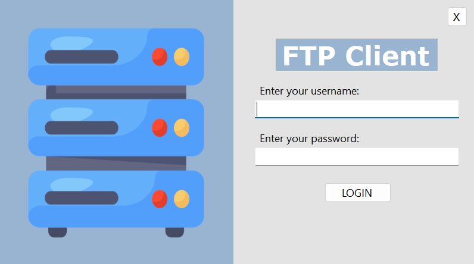
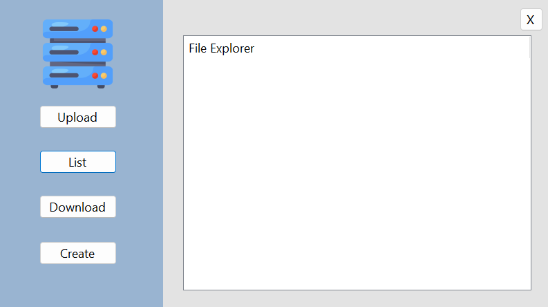
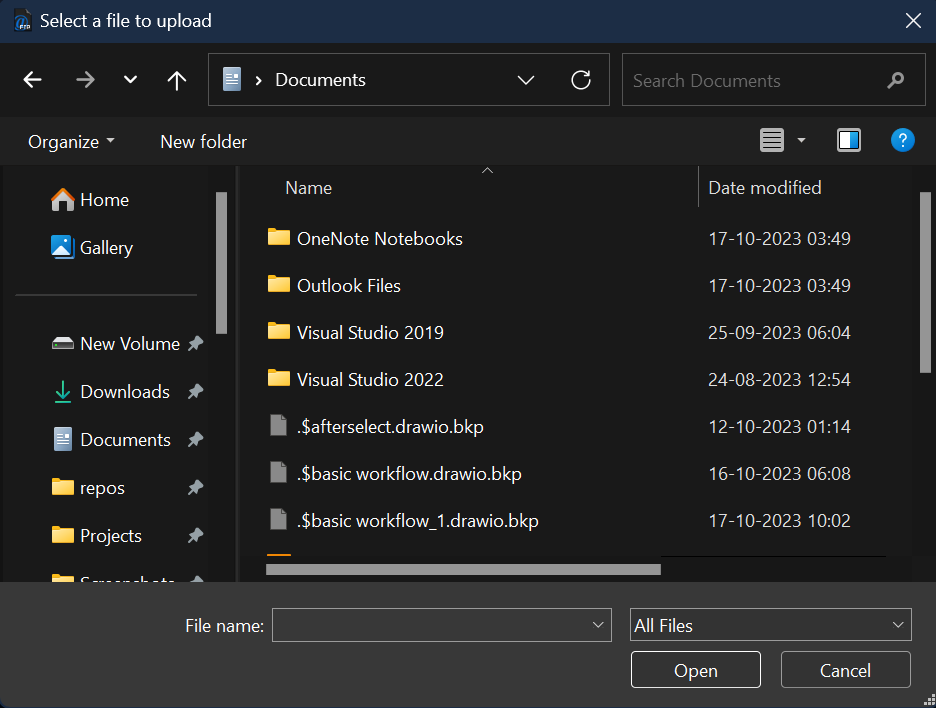
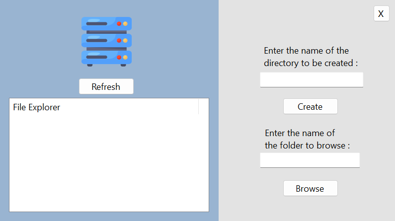
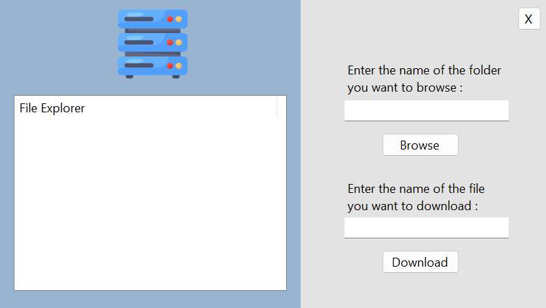

# FTPClient
This is a client application for manipulating files and directories present on a FTP server.

## Features

- **User-Friendly Interface**: An intuitive and user-friendly interface for easy navigation.
- **File upload and download**: Upload and download files to the FTP server.
- **Directory listing**: List all the files and folders present in the directory.
- **Folder navigation**: Traverse through folders.
- **Directory creation**: Ability to create directories in a certain directory.

## Screenshots
The application has a total of four screens:
Firstly, the login page:  

  

Upon legitimate authentication you are presented with the home page where you can upload files:  

  

The pop up you are greeted with when you want to upload a file:

  

This is the page where you can add create directories:  

  

This is the page where you can download files:  

  

## Getting Started

To run this FTP Client application on your computer, follow these steps:
Download the release folder. 
Run the "Client for FTP.exe" in the folder. 

## Acknowledgements

This project was done as a learning exercise.  
The icon is courtesy of https://www.iconarchive.com/show/cats-2-icons-by-mcdo-design/Location-FTP-icon.html, designed by McDo Design. 

